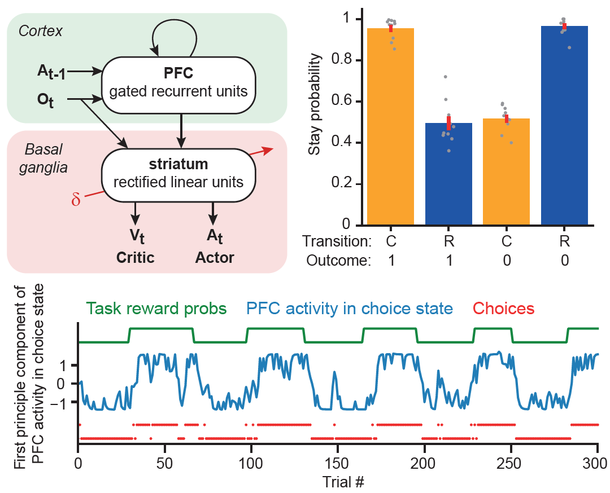

# PFC - Basal-ganglia network model

This repository contains code used to generate the neural network model figure from the manuscript:

> Blanco-Pozo, M., Akam, T., &  Walton, M. (2023).  **Dopamine-independent state inference mediates expert reward guided decision making**  *bioRxiv*, 2023-04.

The model consists of a recurrent neural network representing prefrontal cortex (PFC) and a feedforward network representing basal-ganglia.  The PFC network is trained to predict the next observation and in doing so learns to infer hidden task states.  The basal ganglia network is trained using actor-critic RL (A2C) to predict future reward and choose appropriate actions given the current observation and PFC activity.  

## Usage:

The file `run_experiment.py` contains functions to run a simulation experiment and analyse the data.

-  `run_experiments()` runs 12 simulation runs each for the two model variants shown in the figure and saves the data in the `data` folder.
-  `analyse_experiments()` loads the saved data and runs the analyses, saving figure panels in the `plots` folder.

## Requirements:

- Python 3
- tensorflow
- numpy
- pandas
- matplotlib
- seaborn
- scipy
- scikit-learn
- statsmodels

The figure was generated using Python 3.10.8 and the package versions listed in [requirements.txt](./requirements.txt)

 